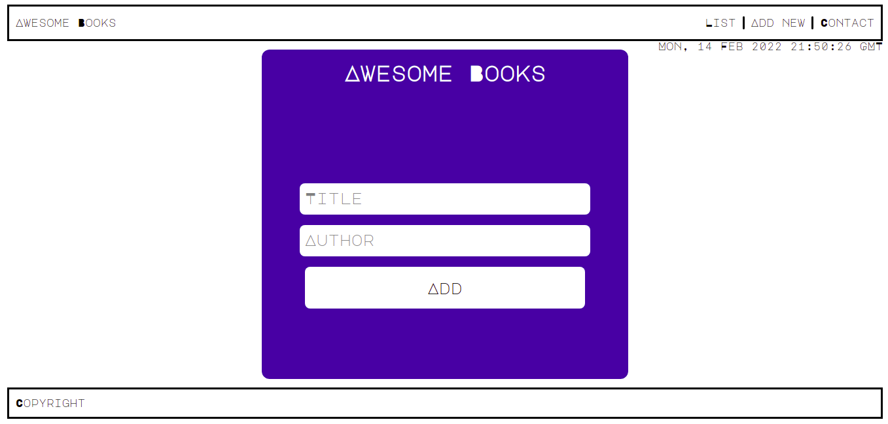

# Awesome Books Using ES6

> A web app to add your books in a digital shelf. This webapp is built with vanila javascript. A local storage option is added with this project, so that a user can store data in this is web app.



## Tech used

- HTML
- CSS
- JS
- Git

## Live Demo

[Live Demo Link](https://vikipretium.github.io/AwesomeBooks-es6/)

# Setup WebApp

#### Cloning the project

```
git clone https://github.com/vikipretium/AwesomeBooks-es6.git
```

## Author

👤 **Vignesh**

- GitHub: [@vikipretium](https://github.com/vikipretium)
- Twitter: [@vikipretium](https://twitter.com/vikipretium)
- LinkedIn: [vikipretium](https://linkedin.com/in/vikipretium)

Contributions, issues, and feature requests are welcome!

Feel free to check the [issues page](../../issues/).

## Show your support

Give a ⭐️ if you like this project!

## Acknowledgments

- Hat tip to anyone whose code was used
- Inspiration
- etc

## 📝 License

This project is [MIT](./MIT.md) licensed.
